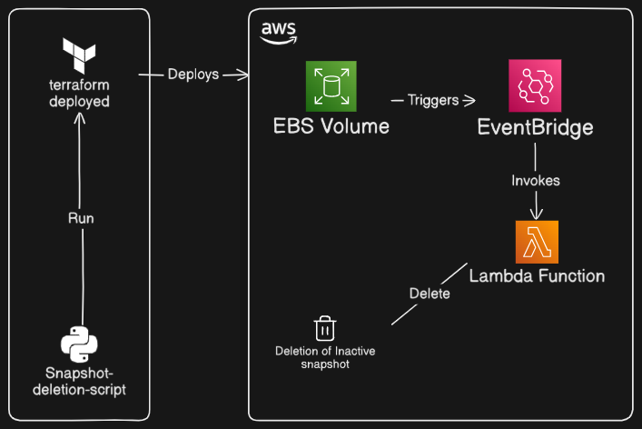
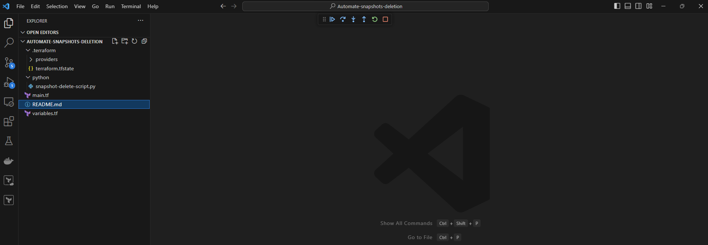

# Bid Farewell to Forgotten Snapshots: Use AWS EventBridge, Terraform, and Serverless to Automate Cleanup! 

AWS accounts may eventually amass resources that are no longer required but nevertheless result in expenses. Neglected EBS snapshots that remain after volumes are erased are a typical example. Handling these photos by hand can be expensive and time-consuming. 

This tutorial demonstrates how to use **Python (Boto3)** in an **AWS Lambda** function to automatically clear up orphaned EBS snapshots. The code is then called via **AWS EventBridge** on a schedule or event.



You will have a comprehensive serverless solution at the end to maintain a tidy and economical AWS setup.

## Prerequisites

### Setting up Terraform and the AWS CLI

Let's make sure the necessary tools are installed first.

### **AWS CLI** 

Command-line access to AWS services is made possible by the AWS CLI.
Install it in accordance with your OS:

>**macOS:** `brew install awscli` using brew

>**Windows:** [AWS CLI Installer](https://aws.amazon.com/cli/)  

>**Linux:** Make use of the package manager (for Ubuntu, `sudo apt install awscli`).

Check the installation:

```
aws --version
```

### **Terraform**

One well-liked Infrastructure as Code (IaC) tool for specifying and controlling AWS resources is Terraform.

>**macOS:** `brew install terraform`

>**Windows:** [Terraform Installer](https://releases.hashicorp.com/terraform/1.10.1/terraform_1.10.1_windows_386.zip)

>**Linux:** Download the binary and move it to `/usr/local/bin`.

Check the installation

```
Terraform -version
```

## Setting up AWS Access

To enable Terraform and Lambda to authenticate with AWS services, set up your AWS CLI with access keys.

**Access keys** can be obtained through the [AWS IAM Console](https://console.aws.amazon.com/iam/).

Set up the AWS CLI:

```
aws configure
```

Enter your **Access Key**, **Secret Access Key**, **output format** (such as _json_), and default region (such as _us-east-1_).

Next, please fork the repository [here](https://github.com/Isameer3056/automate-snapshot-deletion), which has the project's complete code, as we will be using Terraform to build the entire stack.

Open it in a coding editor after cloning it to your local computer.

After using Visual Studio Code, it looks like this:



When you run Terraform from your code editor, the following two files will be recreated, therefore remove them from the project:

- .terraform.lock.hcl
- snapshot-delete-script.zip

Let's now set up the S3 backend:

## **Create a Terraform State S3 Bucket**.

**1. Open the S3 Console first:**

- Go to the S3 service after logging into your AWS account.

**2. Make an entirely new bucket:**

- Click **Create bucket.**
- Name the bucket something **distinctive name**, like `superuser-terraform-state-bucket`.
- For latency considerations, pick an AWS region that corresponds to the area of your infrastructure.

**3. Set Up the Bucket Configuration:**

- To limit access to the bucket, keep the Block Public Access settings turned on.
- Versioning: To preserve a record of modifications made to the state file, enable versioning. This is helpful for rollbacks or disaster recovery.
- Don't change any other settings (leave the default settings).

**4. Create a bucket.**

- To complete the configuration, click **Create bucket**.

## Make a DynamoDB table for state locking (recommended but optional).

To avoid conflicts, state locking using a DynamoDB table guarantees that only one Terraform process can change the state at a time.

**1. Open the DynamoDB Console first:**

- Navigate to DynamoDB on your AWS Console.

**2. Make a Fresh Table:**

- Click **Create table.**
- Give your table a name like `superuser-terraform-state-locking`, for example.
- **Partition Key:** Use the _String_ data type and set the partition key to **LockID**.

**3. Set Up Preferences:**

- Unless you have special needs (such read and write capacity), leave **default settings** in place.
- Click Create table to **create the table**.

## Set up Terraform's IAM Permissions

For Terraform to communicate with **S3** and **DynamoDB** (if locking is being used), certain permissions are required.

Only if you are using the **least privileged** access is this step required. You can omit this step if you already have administrator access.

**1. Establish or utilize an IAM user:**

- Create a Terraform IAM user in the IAM Console if you don't already have one (you can use your own IAM user and attach these policies to it).
- Attach policies that allow access to **DynamoDB** and **S3**.

**2. Attach DynamoDB and S3 Policies:**

Add the following permissions:

- Access to the S3 bucket.
- Access to the DynamoDB table (if utilizing locking).

***or***

Use an inline policy:

An example of an IAM policy

```{
    "Version": "2012-10-17",
    "Statement": [
        {
            "Effect": "Allow",
            "Action": [
                "s3:ListBucket",
                "s3:PutObject",
                "s3:GetObject",
                "s3:DeleteObject"
            ],
            "Resource": "arn:aws:s3:::my-terraform-state-bucket/*"
        },
        {
            "Effect": "Allow",
            "Action": [
                "dynamodb:PutItem",
                "dynamodb:GetItem",
                "dynamodb:DeleteItem",
                "dynamodb:DescribeTable"
            ],
            "Resource": "arn:aws:dynamodb:us-east-1:123456789012:table/terraform-state-locking"
        }
    ]
}
```

Let's look at the Python and Terraform code that will actually work the magic after we've finished all the prerequisites.

## Step 1: Inactive Snapshot Cleaning with Python Code

Open the `snapshot-delete-script.py` file in the python folder in your favorite code editor.

The following is the full function code:

```
import boto3
import logging

logger = logging.getLogger()
logger.setLevel(logging.INFO)

def lambda_handler(event, context):
    ec2_cli = boto3.client("ec2")
    response = ec2_cli.describe_snapshots(OwnerIds=["self"], DryRun=False)
    snapshot_id = []
    for each_snapshot in response["Snapshots"]:
        try:
            volume_stat = ec2_cli.describe_volume_status(
                VolumeIds=[each_snapshot["VolumeId"]], DryRun=False
            )
        except ec2_cli.exceptions.ClientError as e:
            if e.response["Error"]["Code"] == "InvalidVolume.NotFound":
                snapshot_id.append(each_snapshot["SnapshotId"])
            else:
                raise e

    if snapshot_id:
        for each_snap in snapshot_id:
            try:
                ec2_cli.delete_snapshot(SnapshotId=each_snap)
                logger.info(f"Deleted SnapshotId {each_snap}")
            except ec2_cli.exceptions.ClientError as e:
                return {
                    "statusCode": 500,
                    "body": f"Error deleting snapshot {each_snap}: {e}",
                }

    return {"statusCode": 200}
```

This Lambda function lists all EBS snapshots, checks the volume status associated with each snapshot, and deletes snapshots if the volume is no longer available using **Boto3, AWS's Python SDK**.

## Step 2: Setting Up Serverless Infrastructure using Terraform

To deploy this script to AWS, we'll use Terraform to establish a **Lambda function**, **IAM role**, and **policy**. We'll also configure an **EventBridge rule** to start Lambda on a regular basis.

**Setting up Terraform and Configuring the Provider**

Setting up remote state management in S3 is one of the Terraform configurations covered in this section.

Start examining the code as indicated in the ensuing sections after opening the Terraform file `main.tf` in a code editor.

> **NOTE:**
>
> - In accordance with the `Terraform -version` output, modify the `required_version` variable.
>
> - For the S3 backend, update the `bucket`, `key`, and `dynamodb_table` values to correspond with the ones > you generated in the earlier stages.
>
>

```
terraform {
    required_version = ">=1.10.1"
    required_providers {
      aws = {
        source = "hashicorp/aws"
        version = "~>5.80.0"
      }
    }
    backend "s3" {
        bucket = "superuser-terraform-state-bucket"
        key    = "delete-inactive-snapshots/terraform.tfstate"
        region = "us-east-1"
        dynamodb_table = "superuser-terraform-state-locking"
    
    }
}
provider "aws" {
    region = var.aws_region
  
}
```
**Lambda's IAM Role and Policy**

By granting Lambda access to **EC2** and **CloudWatch**, this IAM configuration permits logging and snapshot deletion.

```
resource "aws_iam_role" "lambda_role" {
    name = "terraform_inactive_snapshots_delete_role"
    assume_role_policy = <<EOF
      {
    "Version": "2012-10-17",
    "Statement": [
        {
        "Action": "sts:AssumeRole",
        "Principal": {
            "Service": "lambda.amazonaws.com"
        },
        "Effect": "Allow",
        "Sid": ""
        }
    ]
    }
EOF
}

resource "aws_iam_policy" "iam_policy_for_lambda" {
    name = "terraform_inactive_snapshots_delete_policy"
    path = "/"
    policy = <<EOF
     {
        "Version": "2012-10-17",
        "Statement": [
            {
                "Effect": "Allow",
                "Action": [
                    "logs:CreateLogGroup",
                    "logs:CreateLogStream",
                    "logs:PutLogEvents"
                ],
                "Resource": "arn:aws:logs:*:*:*"
            },
            {
                "Effect": "Allow",
                "Action": [
                    "ec2:DescribeVolumeStatus",
                    "ec2:DescribeSnapshots",
                    "ec2:DeleteSnapshot"
                ],
                "Resource": "*"
            }
        ]
        
    }
    EOF
}

resource "aws_iam_role_policy_attachment" "attach_iam_policy_to_iam_role" {
    role = aws_iam_role.lambda_role.name
    policy_arn = aws_iam_policy.iam_policy_for_lambda.arn
}
```
**Lambda Function Packaging and Deployment**

In this case, the Python code is packaged and made available as a Lambda function.

```
data "archive_file" "lambda_zip" {
    type = "zip"
    source_file = "${path.module}/python/snapshot-delete-script.py"
    output_path = "${path.module}/python/snapshot-delete-script.zip"
}

resource "aws_lambda_function" "lambda_function" {
    filename = "${path.module}/python/snapshot-delete-script.zip"
    function_name = "snapshot-delete-script"
    role = aws_iam_role.lambda_role.arn
    handler = "snapshot-delete-script.lambda_handler"
    runtime = "python3.12"
    timeout = 30
    depends_on = [ aws_iam_role_policy_attachment.attach_iam_policy_to_iam_role ]
}
```

**EventBridge Rule for Invoking Lambda**

You can use **AWS EventBridge** to construct event-based or scheduled triggers for Lambda functions. Here, we'll set up EventBridge to run our Lambda function on a regular basis, such as once every 24 hours.


AWS documentation on scheduled events and EventBridge may be found [here](https://docs.aws.amazon.com/eventbridge/latest/userguide/what-is-amazon-eventbridge.html).

```
resource "aws_cloudwatch_event_rule" "schedule_rule" {
    name = "inactive-snapshots-schedule-rule"
    description = "trigger lambda every day to delete the inactive snapshots"
    schedule_expression = "rate(24 hours)"
}

resource "aws_cloudwatch_event_target" "output" {
    rule = aws_cloudwatch_event_rule.schedule_rule.name
    arn = aws_lambda_function.lambda_function.arn
}

resource "aws_lambda_permission" "allow_eventbridge" {
    statement_id = "AllowExecutionFromEventBridge"
    action = "lambda:InvokeFunction"
    function_name = aws_lambda_function.lambda_function.function_name
    principal = "events.amazonaws.com"
    source_arn = aws_cloudwatch_event_rule.schedule_rule.arn
}
```
## Step 3: Using the Terraform Configuration

Once the infrastructure has been defined, start the Terraform setup and use it:

```
terraform init
terraform apply
```
## Step 4: Lambda Function Testing and Monitoring

To confirm that the solution is effective:

1. **Manually initiate the Event (Optional):** Use the AWS Lambda console to manually initiate the Lambda function for preliminary testing.
2. **Keep an eye on CloudWatch logs:** To confirm snapshot removals, you can examine the logs that the Lambda function sends to CloudWatch.
3. **Modify the timetable if necessary:** To specify a unique frequency for snapshot cleanup, change the schedule_expression.

## Improvements

This project could benefit from the following improvements:

1. Rather than scheduling an Eventbridge rule, Eventbridge might identify when EBS volumes are being deleted, causing the Lambda function to delete the associated snapshot.

2. To handle scenarios where there are a lot of snapshots, paging might be added to the Python method.

### Concluding
To clean up inactive EBS snapshots, we have developed a completely automated, serverless solution that combines **Python (Boto3)**, **Lambda**, **AWS EventBridge**, and **Terraform**. This configuration encourages a neat, effective AWS environment in addition to lowering cloud expenses. You can be guaranteed that orphaned resources are regularly deleted with scheduled invocations.

Experience the advantages of cloud resource management automation by using this solution on your personal AWS account!
